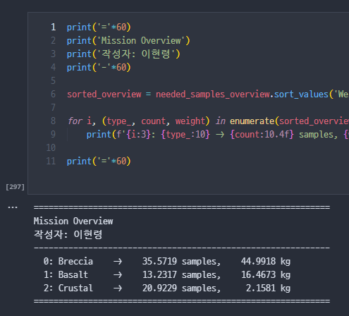
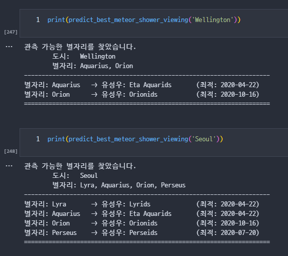
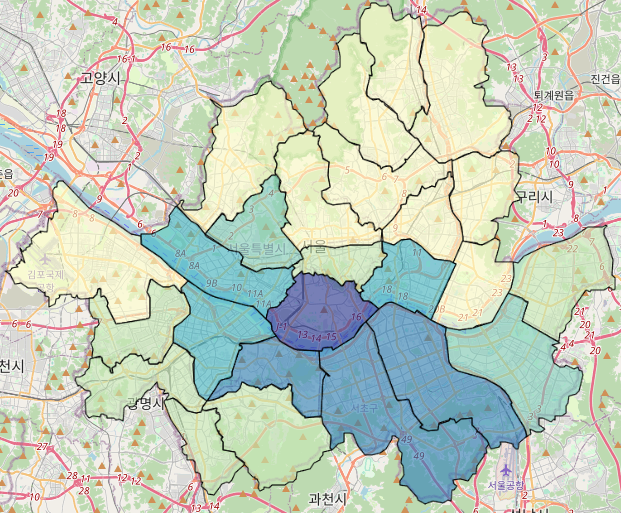
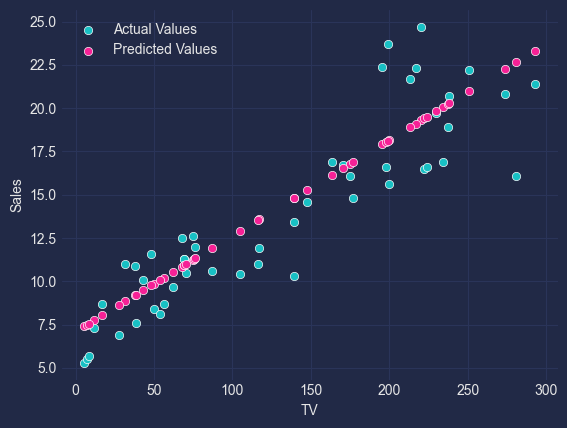
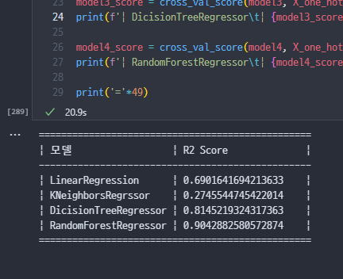
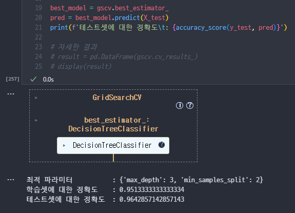
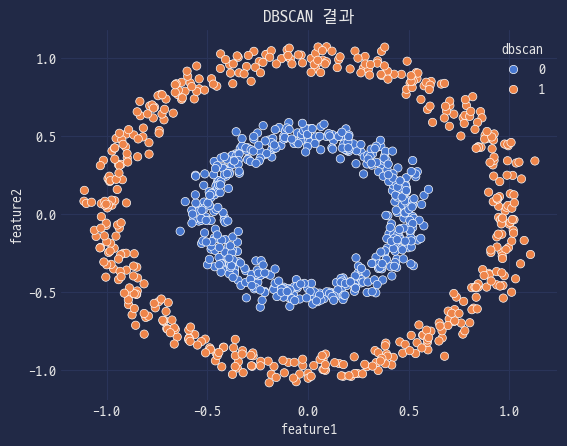
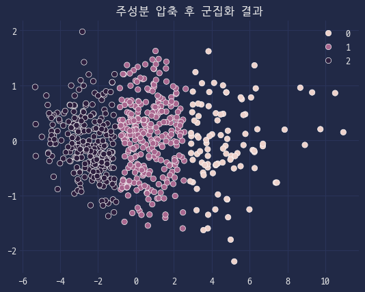

# MS AI School 실습 파일

`python 3.12.7` 버전에서 작성되었습니다. `*.csv`, `*.json`, `*.xlsx` 등의 데이터 파일은 저작권 보호를 위해 저장소에 포함시키지 않고 있으니, 코드 실행 전에 적절한 위치에 직접 데이터 파일을 추가해주세요.

<table>
    <!-- 1행 -->
    <tr><th colspan=999>🐍 <a href="basics/"><code>basics</code></a></th></tr>
    <tr><td colspan=999>파이썬 기초 문법 실습</td></tr>
    <!-- 2행 -->
    <tr>
        <th>🌙 <a href="over-the-moon/"><code>over-the-moon</code></a></th>
        <th>🌠 <a href="meteor-shower/"><code>meteor-shower</code></a></th>
        <th>🚲 <a href="bike"><code>bike</code></a></th>
    </tr>
    </tr>
    <tr>
        <td>달 탐사 샘플 채집 데이터 분석 실습</td>
        <td>유성우 관측 시기 데이터 분석 실습</td>
        <td>공유 자전거 데이터 분석 실습</td>
    </tr>
    <tr>
        <td></img></td>
        <td></img></td>
        <td></img></td>
    </tr>
    <!-- 3행 -->
    <tr>
        <th>📺 <a href="advertising/"><code>advertising</code></a></th>
        <th>🚲 <a href="bike-regression/"><code>bike-regression</code></a></th>
        <th>⚜️ <a href="iris/"><code>iris</code></a></th>
    </tr>
    </tr>
    <tr>
        <td>광고 매체에 따른 판매량 예측 실습</td>
        <td>공유 자전거 대여량 예측 실습</td>
        <td>붓꽃 품종 분류 실습</td>
    </tr>
    <tr>
        <td></img></td>
        <td></img></td>
        <td></img></td>
    </tr>
    <!-- 4행 -->
    <tr>
        <th>🚀 <a href="rocket/"><code>rocket</code></a></th>
        <th>🍇 <a href="clustering/"><code>clustering</code></a></th>
        <th>⚾ <a href="baseball/"><code>baseball</code></a></th>
    </tr>
    </tr>
    <tr>
        <td>상황에 따른 로켓 발사 여부 분류 실습</td>
        <td>군집화 실습</td>
        <td>프로야구 선수 군집화 및 주성분 분석 실습</td>
    </tr>
    <tr>
        <td></img></td>
        <td></img></td>
        <td></img></td>
    </tr>
    <!-- 5행 -->
    <tr>
        <th colspan=999>🕸️ <a href="browser/"><code>browser</code></a></th>
    </tr>
    </tr>
    <tr>
        <td colspan=999>웹 크롤링 & 스크래핑 실습</td>
    </tr>
    <tr>
        <td colspan=999></img></td>
    </tr>
</table>
