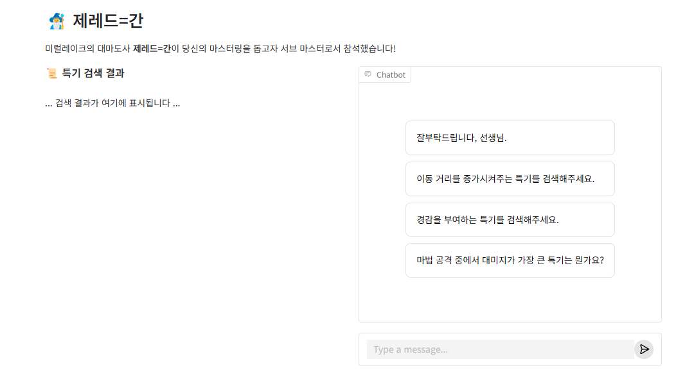
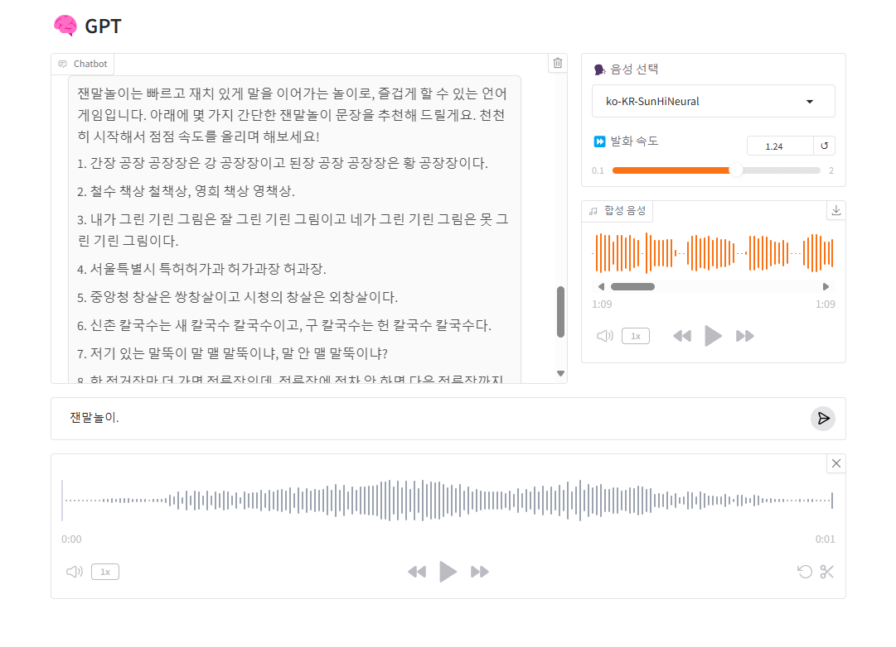
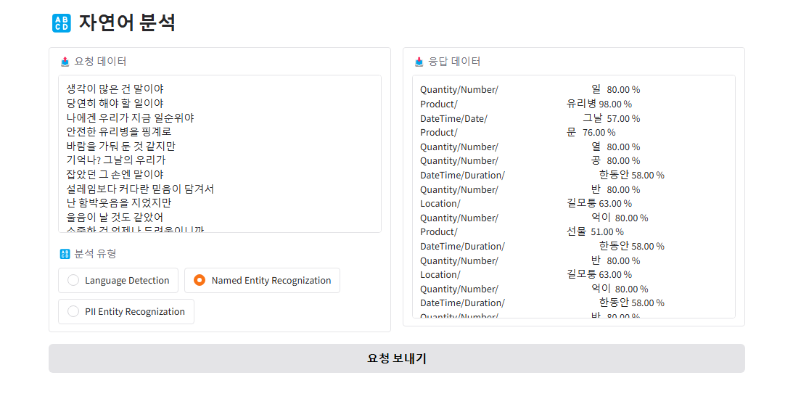
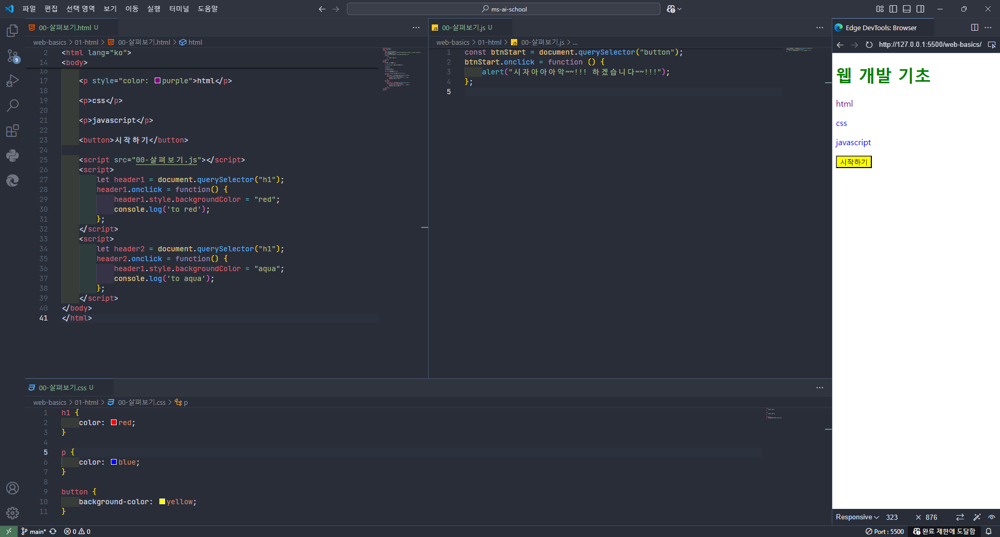
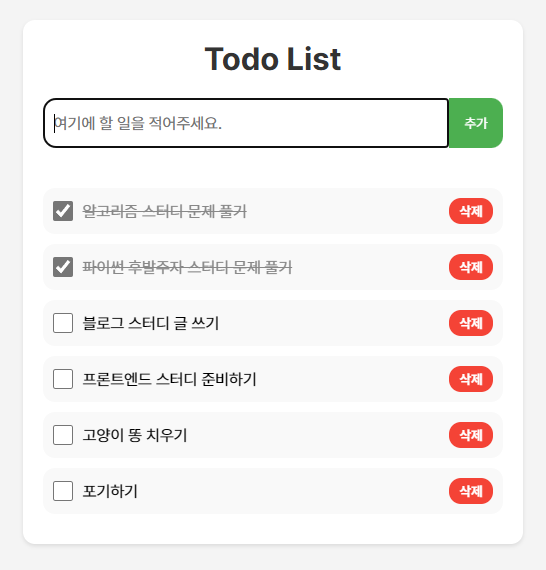
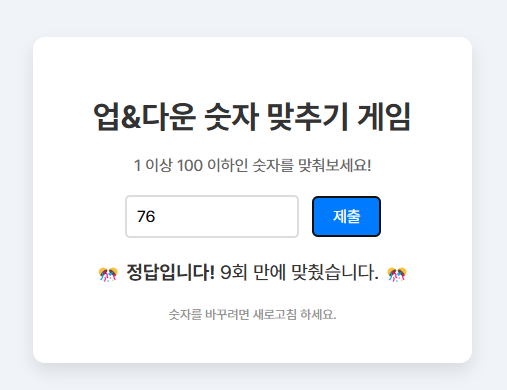
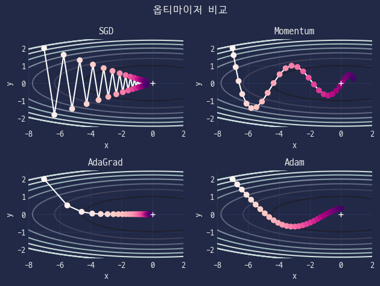
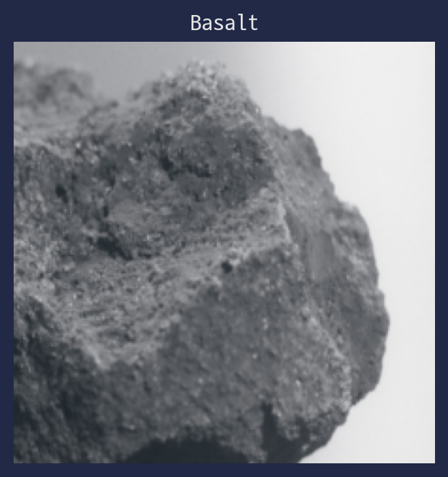
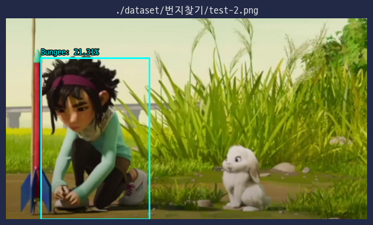
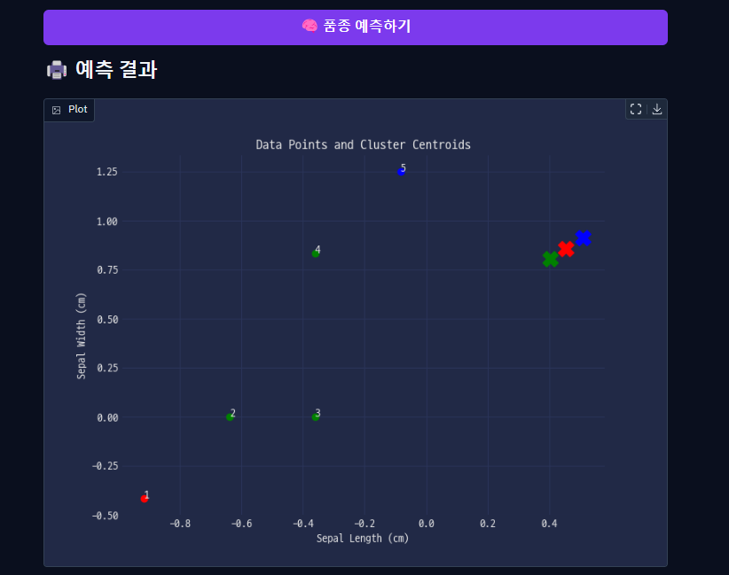

# MS AI School 실습 파일

모든 파이썬 코드는 `python 3.12.7` 버전에서 작성되었습니다.

> [!NOTE]
> `*.csv`, `*.json`, `*.xlsx` 등의 데이터 파일 및 일부 코드는 저작권 보호를 위해 저장소에 포함시키지 않고 있으니, 코드 실행 전에 필요한 파일을 확인하시고 적절한 위치에 직접 파일을 추가해주세요.

## 💙 Azure OpenAI
<table>
    <!-- 1행 -->
    <tr>
        <th>🔍<a href="ai-search/"><code>ai-search</code></a></th>
        <th>🗣️<a href="ai-speech/"><code>ai-speech</code></a></th>
        <th>🔠<a href="ai-language/"><code>ai-language</code></a></th>
    </tr>
    <tr>
        <td>Azure OpenAI와 Search Service를 이용한 RAG 구현 실습</th>
        <td>Azure OpenAI와 Speech Service를 이용한 STT/TTS 구현 실습</td>
        <td>Language Service를 이용한 자연어 분석 실습</td>
    </tr>
    <tr>
        <td></img></th>
        <td></img></td>
        <td></img></td>
    </tr>
</table>

## 📑 웹 프로그래밍
<table>
    <!-- 1행 -->
    <tr>
        <th>🧱<a href="web-basics/"><code>web-basics</code></a></th>
        <th>✅<a href="todo-list/"><code>todo-list</code></a></th>
        <th>↕️<a href="up-&-down/"><code>up-&-down</code></a></th>
    </tr>
    <tr>
        <td>HTML, CSS, JavaScript 기초 실습</th>
        <td>Todo List 구현 실습</th>
        <td>업&다운 숫자 맞추기 게임 구현 실습</th>
    </tr>
    <tr>
        <td></img></th>
        <td></img></th>
        <td></img></th>
    </tr>
</table>

## 🔩 구현
<table>
    <!-- 1행 -->
    <tr>
        <th colspan=2>🐍<a href="basics/"><code>basics</code></a></th>
        <th colspan=2>🧵<a href="neural-net/"><code>neural-net</code></a></th>
        <th colspan=2>🪨<a href="stone/"><code>stone</code></a></th>
    </tr>
    <tr>
        <td colspan=2>파이썬 기초 문법 실습</td>
        <td colspan=2><code>numpy</code> 인공신경망 구현 실습</td>
        <td colspan=2>암석 사진 분류 실습</td>
    </tr>
    <tr>
        <td colspan=2></img></td>
        <td colspan=2></img></td>
        <td colspan=2></img></td>
    </tr>
    <!-- 2행 -->
    <tr>
        <th colspan=3>👁️‍🗨️<a href="custom-vision/"><code>custom-vision</code></a></th>
        <th colspan=3> <a href="iris-gradio/"><code>iris-gradio</code></a></th>
    </tr>
    <tr>
        <td colspan=3>Azure Custom Vision 실습</td>
        <td colspan=3>붓꽃 품종 분류 Gradio 앱 실습</td>
    </tr>
    <tr>
        <td colspan=3></img></td>
        <td colspan=3></img></td>
    </tr>
</table>

## 🔍 데이터 분석
<table>
    <!-- 1행 -->
    <tr>
        <th>🌙<a href="over-the-moon/"><code>over-the-moon</code></a></th>
        <th>🌠<a href="meteor-shower/"><code>meteor-shower</code></a></th>
        <th>🚲<a href="bike"><code>bike</code></a></th>
    </tr>
    </tr>
    <tr>
        <td>달 탐사 샘플 채집 데이터 분석 실습</td>
        <td>유성우 관측 시기 데이터 분석 실습</td>
        <td>공유 자전거 데이터 분석 실습</td>
    </tr>
    <tr>
        <td></img></td>
        <td></img></td>
        <td></img></td>
    </tr>
    <!-- 2행 -->
    <tr>
        <th>📺<a href="advertising/"><code>advertising</code></a></th>
        <th>🚲<a href="bike-regression/"><code>bike-regression</code></a></th>
        <th>⚜️<a href="iris/"><code>iris</code></a></th>
    </tr>
    </tr>
    <tr>
        <td>광고 매체에 따른 판매량 예측 실습</td>
        <td>공유 자전거 대여량 예측 실습</td>
        <td>붓꽃 품종 분류 실습</td>
    </tr>
    <tr>
        <td></img></td>
        <td></img></td>
        <td></img></td>
    </tr>
    <!-- 3행 -->
    <tr>
        <th>🚀<a href="rocket/"><code>rocket</code></a></th>
        <th>🍇<a href="clustering/"><code>clustering</code></a></th>
        <th>⚾<a href="baseball/"><code>baseball</code></a></th>
    </tr>
    </tr>
    <tr>
        <td>상황에 따른 로켓 발사 여부 분류 실습</td>
        <td>군집화 실습</td>
        <td>프로야구 선수 군집화 및 주성분 분석 실습</td>
    </tr>
    <tr>
        <td></img></td>
        <td></img></td>
        <td></img></td>
    </tr>
    <!-- 4행 -->
    <tr>
        <th colspan=999>🕸️<a href="browser/"><code>browser</code></a></th>
    </tr>
    </tr>
    <tr>
        <td colspan=999>웹 크롤링 & 스크래핑 실습</td>
    </tr>
    <tr>
        <td colspan=999></img></td>
    </tr>
</table>
